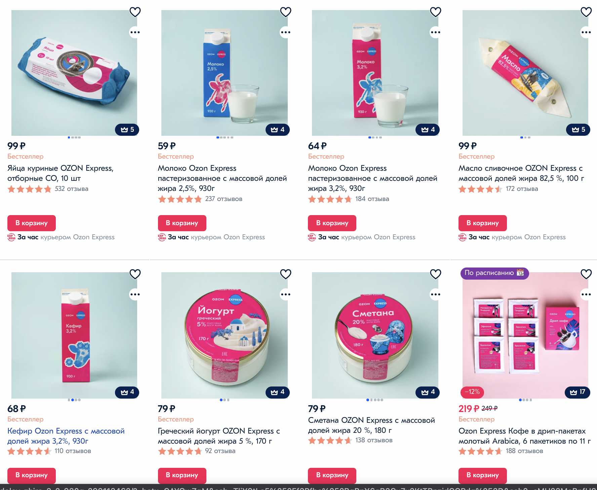
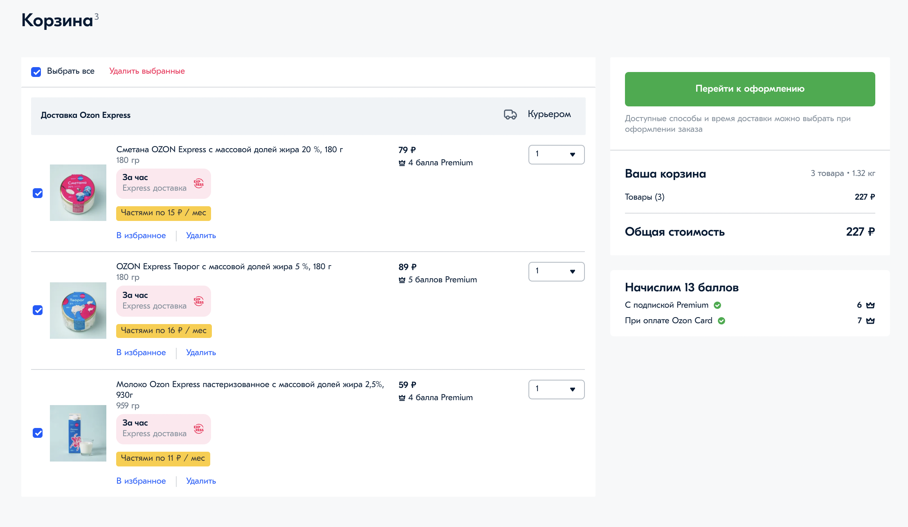

# 📝 Чек-лист

1) Ознакомьтесь с материалом лекций недели
2) Ознакомьтесь с материалами воркшопа
3) Ознакомьтесь с заданием
4) Создайте ветку `feature/…` и выполните задание в ней
5) Подготовьте PR из ветки `feature/…` в ветку `master`
6) Найдите в таблице прогресса своего тьютора
7) Отправьте личным сообщением своему тьютору ссылку на созданный PR

# Домашняя работа: Vuex — интернет-магазин

## Делать всем 🐱:

1. Прочесть материалы лекции
2. Сверстать сайт с двумя страницами, на одной мы должны видеть список продуктов с описанием, а на второй список товаров добавленных в корзинку. Дизайн произвольный, верстать точно так же как на скринах не надо.

## Что сделать обязательно

- Сверстать страничку с продуктами. Продукты получать при инициализации приложения в **Action** через апи [https://random-data-api.com/api/food/random_food?size=30](https://random-data-api.com/api/food/random_food?size=30),
и хранить в сторе (если будете использовать в описании description, то сократить описание до 3 строк).
Картинки продуктов есть в проекте, их можно прикреплять к товарам случайно.
В карточке товара обязательно указывать только название и цену (назначать случайно).

(Примерный макет для страницы с продуктами)

- Сверстать страничку с корзинкой, в которую товары будут добавляться/удаляться через мутацию. Будет показываться общая стоимость через Getter. А при нажатии кнопки "Оформить" список продуктов должен показаться через **Alert**.

(Примерный макет для страницы с корзинкой)

## + Посложнее (💎):

- Добавить возможность выбирать количество товара (На странице с товарами и на странице оформления)
- Сверстать страничку для показа избранных товаров. Для добавления/удаления в избранное использовать мутацию к продуктам (добавлять признак любимого товара). А для самого показа использовать **Getter.**